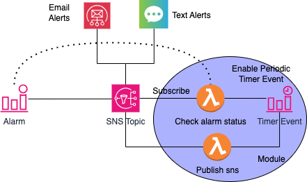

# Periodic Alert: terraform-aws-periodic-alert

## Summary

A Terraform module for generating repeating notifications using two Lambda functions.

## Description

This module generates periodic alerts from CloudWatch Alarms. Typically, when an alert is triggered (e.g., due to a metric exceeding its threshold), AWS generates the alert only once when the state change occurs. However, in some situations, it may be beneficial to generate alerts at periodic intervals until the issue is resolved.

AWS has documented this process in a blog post available at: https://aws.amazon.com/blogs/mt/how-to-enable-amazon-cloudwatch-alarms-to-send-repeated-notifications/.The examples in the AWS blog post use CDK and CloudFormation stacks to generate periodic notifications. In this blog post, we utilize two Lambda functions and Terraform to generate alerts multiple times. 

## Architecture 

Below is the architecture of the implemented solution.



The important resources created by the Terraform module are highlighted in blue ovals, while the existing resources remain unchanged. The solution utilizes the following two Lambda functions:

* check_alarm_status: This Lambda function subscribes to the existing SNS topic where alerts are currently being sent. It checks the alarm status to determine if it is in an ALARM or OK state and enables/disables the periodic timer event accordingly.

* publish_sns: This Lambda function listens to the events published by the periodic timer event and publishes events to the SNS topic at the scheduled frequency. Since the SNS topic is currently being used to send notifications to multiple channels, it will send periodic notifications as appropriate.


## Input Parameters

| Parameter Name                 | Mandatory? | Default Value      | Description                                                           |
| ------------------------------ | ---------- | ------------------ | --------------------------------------------------------------------- |
| sns_topic_arn                  | Yes        | N/A                | SNS topic name where current alarm notifications are being published. |
| alarm_name                     | Yes        | N/A                | Alarm name for which periodic notifications are to be enabled.        |
| periodic_schedule_expression   | No         | 15 mins            | Frequency of notification repeats.                                    |
| context                        | No         | peri_alert         | Resources created by this module will use this parameter as a prefix. |
| check_alarm_status_lambda_name | No         | check-alarm-status | Name of the lambda function                                           |
| runtime                        | No         | python3.10         | Version of python runtime for lambda                                  |
| tags                           | No         | see vars.tf file   | Tags to be applied to the resources created within the module.        |
| region                         | No         | us-east-1          | where to create resources                                             |
| publish_sns_lambda_name        | No         | publish-sns        | Name of the lambda function                                           |

## Output   

N/A

## Example

A fully functional minimal example is available in the example folder. This example uses a Python Lambda function to ping an endpoint every minute and uploads the HTTP response status to a CloudWatch metric. It then utilizes the "terraform-aws-modules/cloudwatch/aws//modules/metric-alarm" to generate an alert when three consecutive values exceed the threshold.

All required parameters are defined in the `terraform.tfvars` file.


## How to Deploy

After seeting the AWS credentials, edit the `terraform.tfvars` file inside the example folder and update the following three parameters:

* email_endpoints 
* phone_numbers 
* app_urls 


```
% terraform init
% terraform validate
% terraform apply
```

